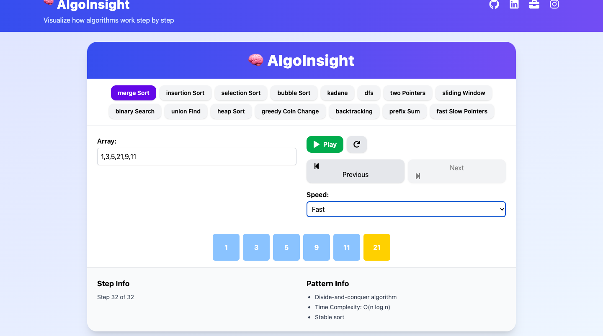
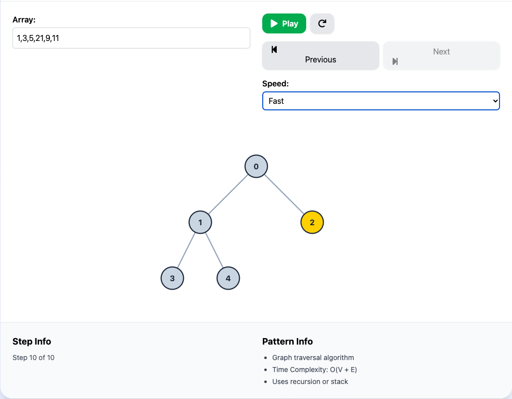
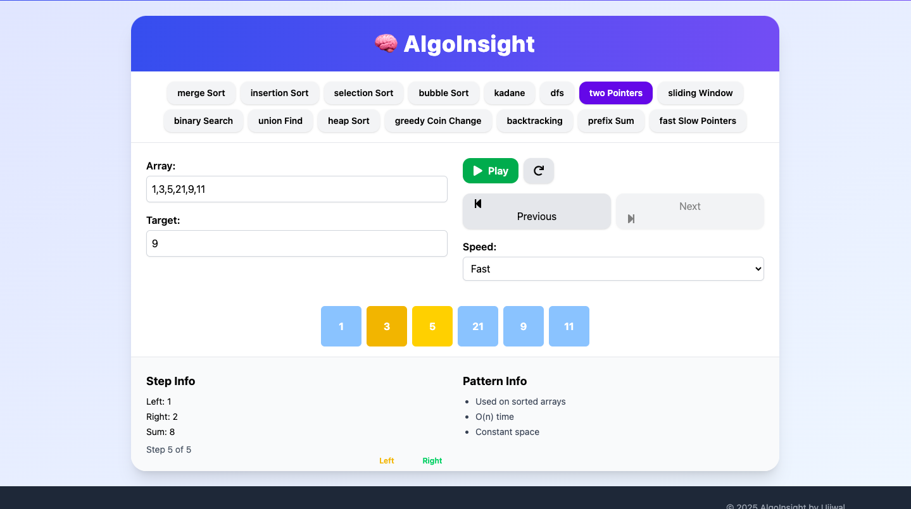

# AlgoInsight 🚀

**Live Demo:** [https://algo-insight.vercel.app](https://algo-insight.vercel.app)

An interactive and visually engaging web application to explore and understand **15 essential algorithmic patterns**. Built for students, developers, and coding interview enthusiasts, AlgoInsight helps demystify complex logic through animations and intuitive controls.

---

## 🧠 Features

✅ **Visualizes 15 Algorithmic Patterns:**

- Merge Sort  
- Insertion Sort  
- Selection Sort  
- Bubble Sort  
- Kadane’s Algorithm  
- Depth-First Search (DFS)  
- Two Pointers  
- Sliding Window  
- Binary Search  
- Union Find  
- Heap Sort  
- Greedy Coin Change  
- Backtracking  
- Prefix Sum  
- Fast & Slow Pointers  

🎮 **Step-by-step Controls:**
- Navigate through each step of the algorithm
- Visual cues highlighting changes and current pointers
- Pause and resume functionality

📱 **Responsive UI:**
- Fully responsive for mobile, tablet, and desktop screens

🌐 **Live Deployed:**  
- Hosted on Vercel: [algo-insight.vercel.app](https://algo-insight.vercel.app)

---

## 🖼️ Screenshots


### 🧩 Merge Sort


### 🔍 DFS Traversal


### 💡 Two Pointers


---

## ⚙️ Tech Stack

- **Frontend:** React.js, Tailwind CSS
- **Version Control:** Git & GitHub
- **Deployment:** Vercel

---

## 🚀 Getting Started

To run the app locally:

### Prerequisites

- Node.js (v14 or newer)
- npm or yarn

### Installation

```bash
# Clone the repo
git clone https://github.com/Ujjwalkumar6200/AlgoInsight.git
cd AlgoInsight

# Install dependencies
npm install
# or
yarn install

# Start development server
npm start
# or
yarn start
```

Open http://localhost:3000 in your browser to use the app.

## 📁 Folder Structure

AlgoInsight/
├── public/
│   └── index.html
├── src/
│   ├── components/        # Reusable UI components
│   ├── patterns/          # Algorithm implementations
│   ├── App.js
│   └── index.js
├── screenshots/           # Add demo screenshots here
├── tailwind.config.js
└── package.json


## 🤝 Contribution
Pull requests and stars are welcome! For major changes, open an issue first to discuss what you'd like to change.

## 📄 License
This project is open-source under the MIT License.

## 🧑‍💻 Author
Made with ❤️ by Ujjwal Kumar


